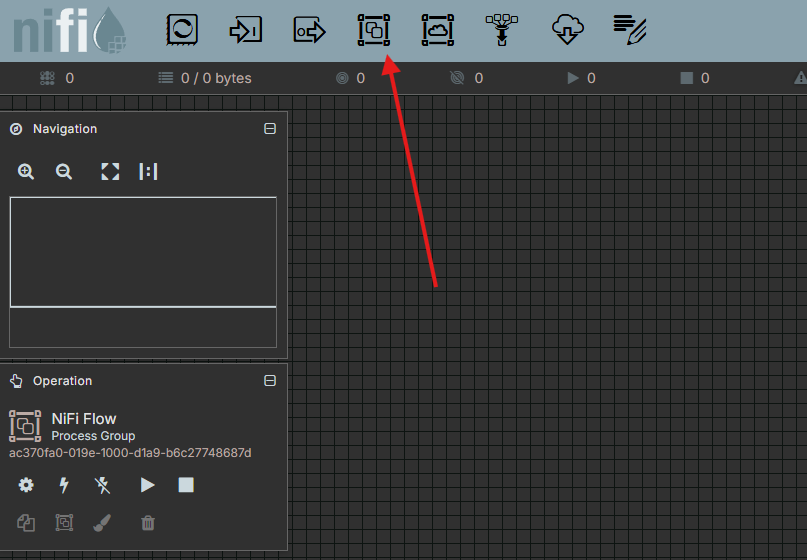
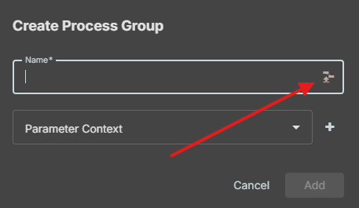
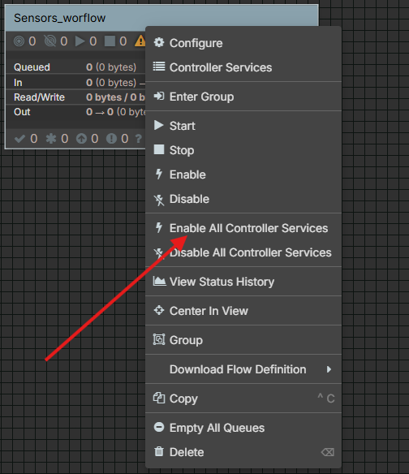

# NiFi Workflow

## Table of Contents / Índice

1. [Workflow Description / Descripción del Flujo](#1-workflow-description--descripción-del-flujo)
2. [Python Tools: Web & Simulator / Herramientas Python: Web y Simulador](#2-python-tools-web--simulator--herramientas-python-web-y-simulador)
3. [Docker Architecture / Arquitectura Docker](#3-docker-architecture--arquitectura-docker)
4. [NiFi Import Guide / Guía de Importación en NiFi](#4-nifi-import-guide--guía-de-importación-en-nifi)
5. [Services Credentials / Credenciales de los Servicios](#5-services-credentials--credenciales-de-los-servicios)

---

## 1. Workflow Description / Descripción del Flujo

**[EN]**
This project implements a complete data pipeline for a smart parking system. The flow operates as follows:
1. **Data Generation**: Simulated sensors generate telemetry (occupancy, temperature, battery) in real-time.
2. **Streaming**: The data is published asynchronously to an Apache Kafka topic (`NiFiworkflow`).
3. **Processing**: Apache NiFi consumes the messages from Kafka, processes them, and routes the data.
4. **Storage**: NiFi ingests the processed data into MongoDB, maintaining a historical record (`Sensors_historic`) and the current state (`Sensors_lastupdate`).
5. **Visualization**: A web interface queries MongoDB and displays the real-time status of the parking bays.

**[ES]**
Este proyecto implementa una tubería de datos completa para un sistema de parking inteligente. El flujo funciona de la siguiente manera:
1. **Generación de Datos**: Sensores simulados generan telemetría (ocupación, temperatura, batería) en tiempo real.
2. **Streaming**: Los datos se publican de forma asíncrona en un tópico de Apache Kafka (`NiFiworkflow`).
3. **Procesamiento**: Apache NiFi consume los mensajes de Kafka, los procesa y enruta la información.
4. **Almacenamiento**: NiFi ingesta los datos procesados en MongoDB, manteniendo un registro histórico (`Sensors_historic`) y el estado actual (`Sensors_lastupdate`).
5. **Visualización**: Una interfaz web consulta MongoDB y muestra el estado en tiempo real de las plazas de aparcamiento.

---

## 2. Python Tools: Web & Simulator / Herramientas Python: Web y Simulador

**[EN]**
The custom code of the project relies entirely on Python, utilizing specific libraries:
*   **Sensor Simulator (`Sensores.py` & `KafkaDAO.py`)**: Uses `kafka-python` to implement a high-performance, thread-safe Kafka Producer. It uses Python's built-in `threading` module to simulate multiple parking sensors concurrently as daemon background tasks.
*   **Web Dashboard (`ParkingWeb.py`)**: Built with **Flask** (a lightweight Python web framework) for the backend and `pymongo` to query the MongoDB database. The frontend is rendered using HTML, CSS (Grid), and JavaScript directly integrated via Flask's `render_template_string`. It fetches the status periodically via AJAX/Fetch API.

**[ES]**
El código a medida del proyecto se basa completamente en Python, utilizando librerías específicas:
*   **Simulador de Sensores (`Sensores.py` y `KafkaDAO.py`)**: Utiliza `kafka-python` para implementar un productor de Kafka seguro para hilos y de alto rendimiento. Usa el módulo nativo `threading` para simular múltiples sensores de parking de manera concurrente mediante tareas en segundo plano.
*   **Dashboard Web (`ParkingWeb.py`)**: Construido con **Flask** (un framework web ligero de Python) para el backend y `pymongo` para consultar la base de datos MongoDB. El frontend se renderiza usando HTML, CSS (Grid) y JavaScript integrado a través de `render_template_string`. Actualiza el estado periódicamente mediante llamadas AJAX/Fetch.

---

## 3. Docker Architecture / Arquitectura Docker

**[EN]**
The entire infrastructure is containerized using `docker-compose`, consisting of the following interconnected services:
*   **`kafka`**: Runs Apache Kafka in KRaft mode (no Zookeeper required) on port `9092`.
*   **`mongodb`**: MongoDB database running on port `27017`. It utilizes an initialization script (`init-mongo.js`) to automatically create the `NiFiworkflow` database and required collections upon creation.
*   **`nifi`**: Apache NiFi engine (port `8080` internally mapped). It awaits Kafka and MongoDB health checks to start successfully.
*   **`sensor-publisher`**: A custom container running the Python sensor simulation. It publishes straight to Kafka.
*   **`parking-web-ui`**: A custom container running the Flask web app, exposing the user interface on port `5000`.

**[ES]**
Toda la infraestructura está dockerizada usando `docker-compose`, compuesta por los siguientes servicios interconectados:
*   **`kafka`**: Ejecuta Apache Kafka en modo KRaft (sin necesidad de Zookeeper) en el puerto `9092`.
*   **`mongodb`**: Base de datos MongoDB en el puerto `27017`. Utiliza un script de inicialización (`init-mongo.js`) para crear automáticamente la base de datos `NiFiworkflow` y sus colecciones.
*   **`nifi`**: Motor de Apache NiFi (puerto `8080`). Espera a que Kafka y MongoDB estén saludables (*healthcheck*) para iniciarse.
*   **`sensor-publisher`**: Contenedor a medida que ejecuta la simulación de sensores en Python y publica en Kafka.
*   **`parking-web-ui`**: Contenedor a medida que ejecuta la aplicación web Flask, exponiendo la interfaz en el puerto `5000`.

---

## 4. NiFi Import Guide / Guía de Importación en NiFi

**[EN]**
To load the data flow into Apache NiFi, follow these steps:
1. Access the NiFi Web UI (`http://localhost:8080/nifi` or `https://localhost:8443/nifi`).
2. Log in using the credentials provided in Section 5.
3. On the left side of the canvas, locate the **Process Group** icon.
4. Click the **Upload Template** icon (looks like a tray with an upward arrow). Choose the XML/JSON template file from your computer and upload it.

5. Once uploaded, drag the **Template** icon from the top toolbar onto the canvas.
6. Select the uploaded workflow from the drop-down list and click **Add**.
7. Start the Process Group by right-clicking it and selecting **Start**.

**[ES]**
Para cargar el flujo de datos en Apache NiFi, sigue estos pasos:
1. Accede a la interfaz web de NiFi (`http://localhost:8080/nifi` o `https://localhost:8443/nifi`).
2. Inicia sesión usando las credenciales provistas en la Sección 5.
3. En la parte izquierda del lienzo (canvas), localiza el icono de **Process Group**.
4. Haz clic en el icono **Upload Template** (una bandeja con una flecha hacia arriba). Selecciona el archivo de plantilla (XML/JSON) en tu ordenador y súbelo.

5. Una vez subido, arrastra el icono de **Template** desde la barra de herramientas superior hacia el lienzo.
6. Selecciona el flujo de trabajo subido en la lista desplegable y haz clic en **Add**.
7. Inicia el Grupo de Procesos (Process Group) haciendo clic derecho sobre él y seleccionando **Start**.

---

## 5. Services Credentials / Credenciales de los Servicios

**[EN]**
To access the different services provided in this environment, use the following default credentials.

**[ES]**
Para acceder a los distintos servicios provistos en este entorno, utiliza las siguientes credenciales por defecto.

| Service / Servicio | URL / Port | Username / Usuario | Password / Contraseña |
| :--- | :--- | :--- | :--- |
| **Apache NiFi** | `http://localhost:8080/nifi` | `hadoop` | `hadoophadoop` |
| **MongoDB** | `localhost:27017` | `admin` | `1234` |
| **Parking Web UI** | `http://localhost:5000` | *(No auth / Sin autenticación)* | *(No auth / Sin autenticación)* |
| **Apache Kafka** | `localhost:9092` | *(PLAINTEXT / Sin autenticación)* | *(PLAINTEXT / Sin autenticación)* |

---
*Built with Python, Apache NiFi, Kafka, and MongoDB.*